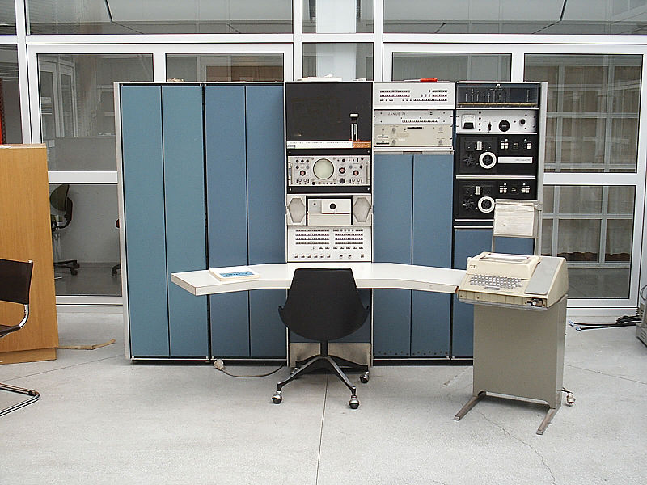
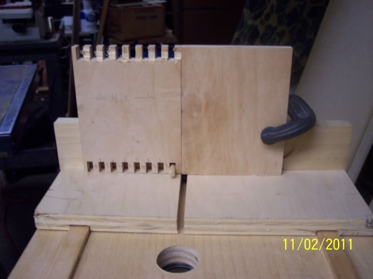

title: Go Scratch That Itch
author:
    name: John Gosset
    twitter: jgosset_
    github: qjcg
theme: ./vendor/github.com/select/cleaver-select-theme
controls: true
progress: false
output: index.html
style: style.css

-- cover

# Go Scratch That Itch
## John Gosset

---

### Who?

- GitHub: [@qjcg](https://github.com/qjcg)
- Twitter: [@jgosset_](https://twitter.com/jgosset_)
- Consultant & software developer (Montreal, Canada)
- Server software and embedded systems
- Organizations large & small
- Contractor for [RedHat], and volunteer with the [Software Carpentry
  Foundation] to help research scientists learn programming fundamentals.
- Believe programming can be for everybody.

[RedHat]: https://www.redhat.com
[Software Carpentry Foundation]: https://software-carpentry.org

---

### What?

- "There should be code that does that!"
- Here to convince you to do, instead of not do
- Your problems matter
- It's a simple message, but simple can be hard

---

### How?

- Small is different
- Scratching itches
- Some well-known itches
- Why Go philosophy and features are well-suited to programming in-the-small

---

# Small is different

--- cat

## Schrodinger's Cat

--- tdist

---

### Stephen J. Gould: Size and Shape

> The geometry of space itself is the major reason for correlations between size
> and shape. **Simply by growing larger, an object that keeps the same shape will
> suffer a continual decrease in relative surface area**. The decrease occurs
> because volume increases as the cube of length (length x length x length), while
> surface increases only as the square (length x length): in other words, **volume
> grows more rapidly than surface**.

--- .sizeandshape

### Stephen J. Gould: Size and Shape (cont'd)

> I once overheard a children’s conversation in a New York playground. Two young
> girls were discussing the size of dogs. One asked: “Can a dog be as large as
> an elephant?” Her friend responded: “No, if it were as big as an elephant, it
> would look like an elephant.” I wonder if she realized how truly she spoke.

---

### Stephen J. Gould: Size and Shape (cont'd)

- As you scale up software, surface area (ex: public API) can be dragged down by
  supporting utility functions, tooling, boilerplate code, etc
- Avoid unnecessary complexity
- Ask: "Can we keep this small?"

---

### In-the-large versus In-the-small

- [Programming in the large and programming in the small](https://en.wikipedia.org/wiki/Programming_in_the_large_and_programming_in_the_small) (DeRemer & Kron, 1975)
- **in-the-small**: does one thing well, often coded by single developer, complete in itself
- **in-the-large**: industrial teams working on systems project, months to years, often broken up into submodules

---

### Scratching Itches

> Every good work of software starts by scratching a developer's personal itch.
> -- Eric S. Raymond, [The Cathedral and the Bazaar](http://www.catb.org/~esr/writings/cathedral-bazaar/cathedral-bazaar/)

Who?
- Coined the term Open Source and founded the [Open Source Initiative](https://opensource.org)
- Wrote the guidebook for [NetHack](http://www.nethack.org)
- Currently working on the [NTPsec](https://ntpsec.org) project, he also
  two days ago wrote: [Rust vs.  Go](https://blog.ntpsec.org/2017/01/18/rust-vs-go.html) (head-to-head
  comparison. Will be implementing new NTPsec functionality in Go).

---

### The Story of Unix

- [Space Travel] developed by Ken Thompson on a GE635 system

[Space Travel]: https://en.wikipedia.org/wiki/Space_Travel_(video_game)

---

### The Story of Unix

- Wanted to port to PDP7 for better display & graphics system, but also wanted a
  minimalistic OS to run it on...

--- gsti

# Go Scratch That Itch!

---

### Jennifer Dewalt

- Art graduate with no programming experience, wanted to learn how to turn her
  creative ideas into code...

--- gsti

# Go Scratch That Itch!

---

### Jennifer Dewalt

- [180 websites in 180 days](http://jenniferdewalt.com/)
- Each day a new small, self-contained project, open-sourced on GitHub & blogged
- Approach: JFDI (Just F'n Do It!)
- Inspirational!

---

### A tiny personal example

- Wanted to create something to generate placeholder text and learn more about
  Unicode...

--- gsti

# Go Scratch That Itch!

---

### One of my own

- [horeb](https://github.com/qjcg/horeb)
- Small program written to scratch a personal itch
- Don't like it? Don't find it useful? Not your cup of tea?
- Cool with me! Your opinion of it is **not the point!**

---

### Scratching Itches: Everybody has problems

- Everybody has problems
- Your problems are important!
- You have **unique local knowledge**
- Contrast with "Centrally Planned Software" / design by committee

---

### A few principles for programming in the small

- Solve the problem in the concrete first
- Consider existing tools
- The [Unix Philosophy](https://en.wikipedia.org/wiki/Unix_philosophy)
- YAGNI
- Make your objectives clear (see eg.: [README-driven development](http://tom.preston-werner.com/2010/08/23/readme-driven-development.html))

---

### Unix Philosophy

> This is the Unix philosophy: Write programs that do one thing and do it well.
> Write programs to work together. Write programs to handle text streams, because
> that is a universal interface. -- Doug McIlroy

- [Rob Pike's Five Rules of Programming](http://users.ece.utexas.edu/~adnan/pike.html)
- [Plan9's](https://en.wikipedia.org/wiki/Plan_9_from_Bell_Labs) [Acme], an
  *"Integrating"* Development Environment
    - Watch [Russ Cox's Tour of Acme screencast](https://www.youtube.com/watch?v=dP1xVpMPn8M)

[Acme]: https://en.wikipedia.org/wiki/Acme_(text_editor)

---

### YAGNI

You Ain't Gonna Need It

---

# Go is good for programming in the small

---

### Go Spec

- Consider the name "Go": short & simple, moving & doing
- [The Go Spec](https://golang.org/ref/spec) is short and readable

---

### Go Says "No"

- [RSC on Generics](http://research.swtch.com/generic)
- [Go FAQ: Exceptions](https://golang.org/doc/faq#exceptions)
- Go is implemented as a procedural language (not e.g. primarily
functional)

---

### Easy Deployment

- Simple, minimalistic tooling (cf. Makefiles, venvs, package.json...)
- Cross compilation is trivial (`GOOS`, `GOARCH`)
- Static binaries

---

### Polymorphism Without Pain

- [Interfaces](https://gobyexample.com/interfaces) allow code re-use like with
  OO-style polymorphism, but via composition instead of requiring rigid object
  hierarchies

---

### Go is a shop-built jig

- [Blog post by Rob Napier](http://robnapier.net/go-is-a-shop-built-jig)

> Go feels under-engineered because it only solves real problems.

---

### Go is a shop-built jig (cont'd)

> [...] little pieces of wood that help you hold plywood while you cut it, or spacers
> that tell you where to put the guide bar for a specific tool, or hold-downs that
> keep a board in place while you’re working on it. They’re not always pretty.
> They often solve hyper-specific problems and work only with your specific tools.
> And when you look at ones that have been used a lot, they sometimes seem a
> little weird.

---

### Go is a shop-built jig (cont'd)

> There might be a random cutout in the middle. Or some little piece that sticks
> off at an angle. Or the corner might be missing a piece. And when you compare
> them to “real” tools, “general” tools like you’d buy from a catalog, they’re
> pretty homey or homely depending on how you’re thinking about it.
> [...] really good at solving [...] very common problems for people who need
> to ship software

---

### Key Takeaways

Principles when programming in the small:
- Write down what you want (eg: [README driven development](http://tom.preston-werner.com/2010/08/23/readme-driven-development.html))
- Solve the problem in the concrete first
- Keep the [Unix Philosophy](https://en.wikipedia.org/wiki/Unix_philosophy) in mind
- YAGNI
- When in doubt, use brute force

---

### Key Takeaways (cont'd)

Go features good for programming in the small:
- small spec
- says "no" to keep the language small
- easy deployment
- interfaces for polymorphic code reuse without rigid object hierarchies
- excellent ecosystem and community

---

### Conclusion

- Programming in the small is good
- Go is good for programming in the small
- **Your problems matter**!
- You should...

--- gsti

# Go Scratch That Itch!

---

### References

- Background
    - [README Driven Development](http://tom.preston-werner.com/2010/08/23/readme-driven-development.html)
    - [Programming in the large and programming in the small]
    - [Unix Philosophy](https://en.wikipedia.org/wiki/Unix_philosophy)
    - [Worse is Better](https://en.wikipedia.org/wiki/Worse_is_better)
    - [When in doubt, use brute force](http://www.catb.org/jargon/html/B/brute-force.html)
    - [Stephen J Gould: Size and Shape](http://www.naturalhistorymag.com/editors_pick/1974_01_pick.html)
    - [The Art of Unix Programming: The Right Size of Software](http://www.catb.org/esr/writings/taoup/html/ch13s04.html)

[Programming in the large and programming in the small]: https://en.wikipedia.org/wiki/Programming_in_the_large_and_programming_in_the_small

---

### References (cont'd)

- Itches
    - [The Story of Unix & Space Travel](https://www.bell-labs.com/usr/dmr/www/spacetravel.html)
    - [Jennifer Dewalt: 180 Websites in 180 days](https://jenniferdewalt.com/)
    - [horeb](https://github.com/qjcg/horeb)
- Go
    - [The Go Spec](https://golang.org/ref/spec)
    - [Go Proverbs](https://go-proverbs.github.io/)
    - [Go is a shop-built jig](http://robnapier.net/go-is-a-shop-built-jig)
